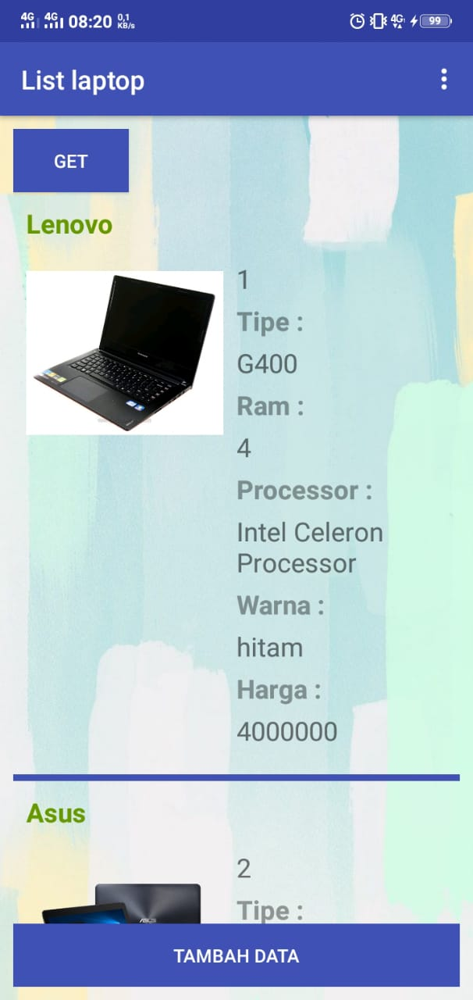

# Katalog Laptop
| Grup | 12 |
| :---------------: | :---------------:|
| Hasna Alifira | 13 |
| Nurul Istikhomah | 22 |

## Deskripsi
Aplikasi Katalog Laptop adalah sebuah aplikasi yang digunakan untuk mengetahui daftar laptop terbaik dan spesifikasinya yaitu terdapat merk laptop, tipe laptop, ram, processor dan harga laptop

## Screenshots
+ 
+ 
+ 
+ 
+ 
+ 

## Android OS dan Level
Grandle Build v28 Minimum Android API 22, Android Version 5.1 (Lollipop)

## List class
## Katalog Laptop Admin
+ Suka.java digunakan untuk membuat data tabel suka disertai set dan get
+ GetSuka.java digunakan untuk membuat list data tabel suka
+ PostPutDelSuka.java digunakan untuk fungsi post, put dan delete tabel suka
+ MainActivity.java digunakan untuk menampilkan list data suka
+ MyAdapter.java digunakan untuk adapter data list suka
+ Laptop.java digunakan untuk membuat data tabel laptop disertai set dan get
+ GetLaptop.java digunakan untuk membuat list data tabel laptop
+ LaptopAdapter.java digunakan untuk adapter data list laptop
+ OpsiMenu.java digunakan untuk menampilkan pilihan menu 
+ ApiClient.java digunakan untuk base url 
+ ApiInterface.java digunakan untuk memanggil tabel  

## KatalogLaptopUser

## Referensi

